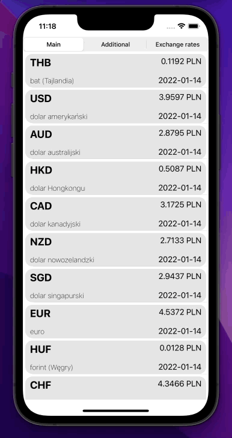
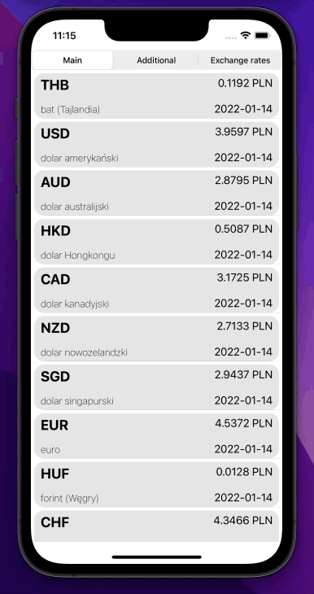
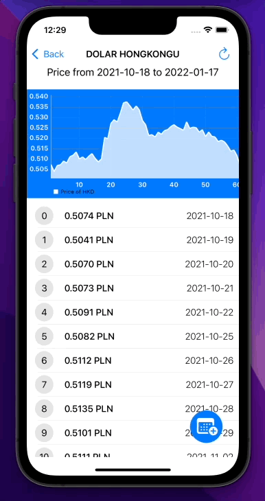
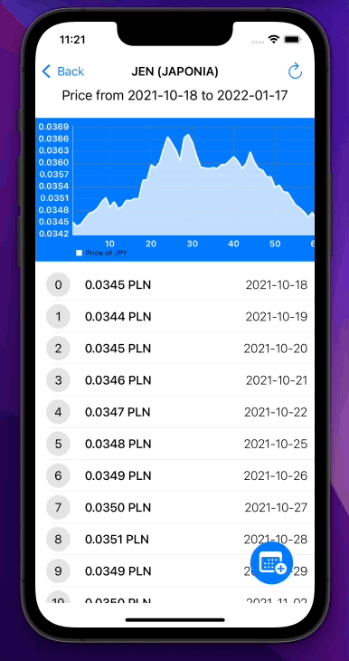

# NBP currency app 🏦

## DEMO
This project is a currency app made with NBP's API. </br>
Allows user to get all necessary information about currencies. </br>
 </br>

## APP DESIGN
This app contains total 2 screens:
- main view with a table of currencies according to selected table type (main currencies, additional currencies and exchange rates). User can scroll data and manually refresh it by pulling down.</br>
- second screen with a detailed view of selected currency in the specific time period (that could be changed). </br>
The user is able to manually refresh data and set a new range of data. </br>

## DETAIL VIEW
A detail view is a screen where users can check the price of the currency in a specific range of dates. </br>
The maximum range length that is mentioned in API is 93 days so this app also allows a max range of 93 days to be selected. </br>
It's worth mentioning that bigger ranges also work this app is made according to API documentation. </br>
The range can be changed by pressing a floating button with a calendar icon. </br>
On the right side of the navigation controller is a button that allows the user to manually refresh data. </br>

 </br>

Users can go to details about selected currency just by pressing it. </bd>
However for some data (additional currencies) there is no details. To prevent crashes users can't go into detail about this currency and special information is being shown. </br>

 </br>

## INVALID RANGES
Users can set an invalid range. </br> </br>

The app must check if the selected range is valid and if not use the last valid range. </br>
In case the user chooses the wrong range special information is being shown that describes what has gone wrong. </br>
Valid range rules:
- the first date must be earlier than the second date
- non of dates can be after the current date
- single range cannot be larger than 93 days

What happens when the user choose the wrong range: </br>

### Dates cannot be in future becasue there is no data:
 </br>

### Max range is 93 days:
 </br>

### First date must be before second:
 </br>

## PROJECT REQUAIRMENTS 📄
Write a simple system support application from iOS 10, which displays the exchange rates downloaded from the National Bank of Poland's API (http://api.nbp.pl). </br>

1. Main screen:
  - Displays the currency rates from the endpoint http://api.nbp.pl/api/exchangerates/tables/{table}/
  - You want to change the table you are displaying, the table parameter from the endpoint,
  - Cells from UIColleticon View or UITableView should be created other than system cells,
  - Cells should include information on:
    - Date entered
    - The name of the currency
    - The currency code
    - The average value of the course
  - Pressing a cell with a currency moves to (2. Currency screen),
  - The user has the ability to refresh the data manually,
  - The screen should show the data loading CLIP.
2. Detail Screen (range rates)
  - The title should include the currency name,
  - The screen displays the average exchange rates for the selected by the date user from the endpoints http://api.nbp.pl/api/exchangerates/rates/{table}/{code}/{startDate}/{endDate}/
  - The user must be able to select dates on this screen.
  - The user has the ability to refresh the data manually,
  - The screen should show the data loading CLIP.

## REQUAIRMENTS 📄
- iOS 10.0+
- Xcode 13.1

## Installation
This app requaires [Charts 3.6.0](https://cocoapods.org/pods/Charts). It's a module that supports adding charts to iOS project. It's on Apache-2.0 license.
#### CocoaPods
You can use [CocoaPods](http://cocoapods.org/) to install `Charts` by adding it to your `Podfile`:

```ruby
pod 'Charts'
```

Then use command `pod install` inside terminal to install selected pod:

```bash
pod install
```

